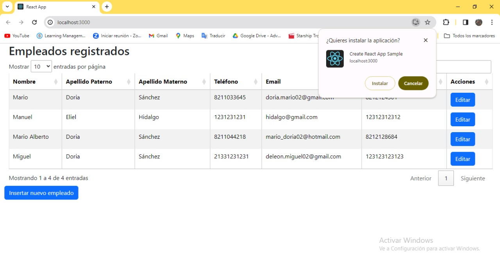

# Registro 2.0

La aplicación constaba con una tabla donde se muestran los usuarios 
registrados, con alguna información general, como: Nombre completo con 
campos separados, número telefónico ya sea de casa o celular, un correo de 
contacto y un numero alternativo de contacto.
## Funciones
### Módulo de Gestión de Contenido:
#### • Registro de usuario

#### • Mostrar usuario

## Aplicacion instalable en la computadora
Al momento de correr nuestro programa nos permite instalar como una aplicacion en nuestra computadora

## Iniciar tu api

Antes de empezar a correr tu proyecto de react, es necesario hacer la coneccion a la base de datos en este caso nuestra base de datos ya esta hecha en un servidor local, pero se comparte una query en donde podran hacerla junto con la tabla y los store proces necesarios para que funcione, que sin ella nuestro proyecto no lograra andar, para eso es necesario una api, en la cual viene incluido dentro de la carpeta tambien, pero para que puedas correrla esta debe de correr aparte, se recomienda correr en una terminal el api y en otra termila correr el proyecto de react, a continuacion comparto una imagen de las dos carpetas del api y sql:

Nota: tambien se incluye una carpeta llamada sql, el cual contiene un query que inserta una base de datos llamada registro, que a subes crea una tabla llamada Usuarios que es el destinatario de donde mostraremos e insertaremos los datos al igual que los comandos de store procedures para obtener los datos de la tabla al igual que se insertan datos nuevos.

Nota final: Se dejaron comentarios en el codigo que les puede facilitar un poco mas a la hora de acoplar el proyecto, ya que hay algunos cambios que se le deben de hacer, por ejemplo la direccion de la base de datos en el api el cual se encuentre en el archivo "config.py" dentro de la carpeta del api, en mi caso yo tengo usuario y contraseña,  si no lo tienen no lo agregen, pero esto es para agregar mas seguridad a su base de datos.

## ¿Como correr una api de python?
Se inicia con la terminal, dentro de la direccion en este caso como en la api ya tenemos un entorno virtual no se agrega, pero anexo el comando el cual se debe de ejecutar desde la direccion de su carpeta en la terminal.

### py -m venv env

Una vez que tengamos el entorno virtual lo siguiente es activar el entorno virtual, el cual se activa ejecutando el comando en nuestra terminal posicionandonos en la direccion de nuestra api.

### env\Scripts\activate
Tal y como se ve en nuestro ejemplo:

Luego se usa el siguiente comando:
### python app.py
en  este caso se uso app.py por que asi se llama mi archivo proncipal en la carpeta del api.

Para mas información de como iniciar un proyecto de una api con python y flask, les dejo el siguiente link:
(https://www.solvetic.com/tutoriales/article/8890-instalar-flask-en-windows-10/)

## Iniciar un proyecto en react

En el directorio de tu proyecto, tu puedes correr el siguiente comando:
### `npm start`
Tal y como se muestra en el siguiente ejemplo: 

El proyecto correra en la siguiente direccion.\
Abre [http://localhost:3000](http://localhost:3000) para ver tu proyecto.

