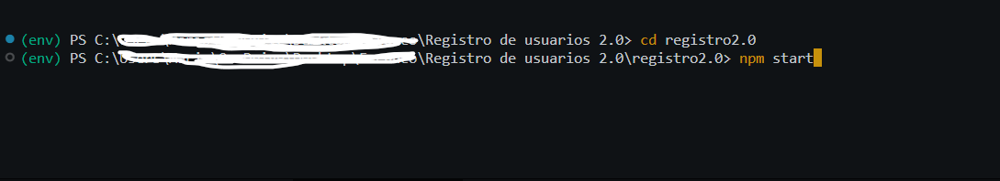

# Registro 2.0

La aplicación constaba con una tabla conde se muestran los usuarios 
registrados, con alguna información general, como: Nombre completo con 
campos separados, número telefónico ya sea de casa o celular, un correo de 
contacto y un numero alternativo de contacto.
## Funciones
### Módulo de Gestión de Contenido:
#### • Registro de usuario

#### • Mostrar usuario

## Iniciar tu api

Antes de empesar a correr tu proyecto de react, es necesario hacer la coneccion a la base de datos en este caso nuestra base de datos ya que si ella nuestro proyecto no lograra andar, para eso es necesario una api, en la cual viene incluido dentro de la carpeta, pero para que puedas correrla esta debe de correr aparte, se recomienda correr en una terminal el api y luego correr el proyecto de react:

## ¿Como correr una api de python?
Se inicia con la terminal, dentro de la direccion en este caso como en la api ya tenemos un entorno virtual no se agrega, pero anexo el comando el cual se debe de ejecutar desde la direccion de su carpeta en la terminal 
### py -m venv env
Una vez que tengamos el entorno virtual lo siguiente es activar el entorno virtual, el cual se activa ejecutando el comando en nuestra terminal posicionandonos en la direccion de nuestra api
### env\Scripts\activate
Tal y como se ve en nuestro ejemplo:

Para mas informacion de como iniciar un proyecto de una api con python y flask, les dejo el siguiente link:
(https://www.solvetic.com/tutoriales/article/8890-instalar-flask-en-windows-10/)

## Iniciar un proyecto en react

En el directorio de tu proyecto, tu puedes correr el siguiente comando:
### `npm start`
Tal y como se muestra en el siguiente ejemplo: 

El pryecto correra en la siguiente direccion.\
Abre [http://localhost:3000](http://localhost:3000) para ver tu proyecto.

